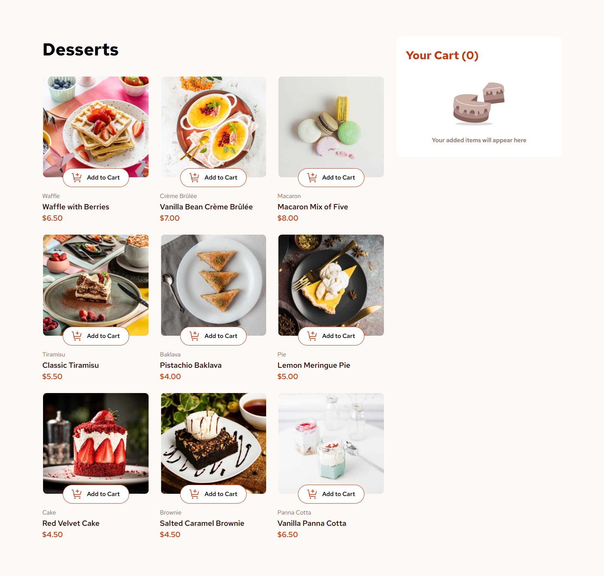

# Frontend Mentor - Product list with cart solution

This is a solution to
the [Product list with cart challenge on Frontend Mentor](https://www.frontendmentor.io/challenges/product-list-with-cart-5MmqLVAp_d).
Frontend Mentor challenges help you improve your coding skills by building realistic projects.

## Table of contents

- [Overview](#overview)
    - [The challenge](#the-challenge)
    - [Screenshot](#screenshot)
    - [Links](#links)
- [Built with](#built-with)
- [Author](#author)

## Overview

### The challenge

Users should be able to:

- Add items to the cart and remove them
- Increase/decrease the number of items in the cart
- See an order confirmation modal when they click "Confirm Order"
- Reset their selections when they click "Start New Order"
- View the optimal layout for the interface depending on their device's screen size
- See hover and focus states for all interactive elements on the page

### Screenshot

### Links

- Solution URL: [Frontend Mentor Solutions](https://www.frontendmentor.io/solutions/product-list-with-cart-NN0UxHdDRu)
- Live Site URL: [Github pages](https://sam4web.github.io/product-list-with-cart/)

## Built with

- [Vue](https://vuejs.org/): JavaScript Framework
- [Tailwind](https://tailwindcss.com/): CSS framework
- SCSS
- Mobile-first workflow

## Author

- Website: [Sijal Manandhar](https://sijalmanandhar.com.np/)
- Frontend Mentor: [@sam4web](https://www.frontendmentor.io/profile/sam4web)
- Github: [@sam4web](https://github.com/sam4web)